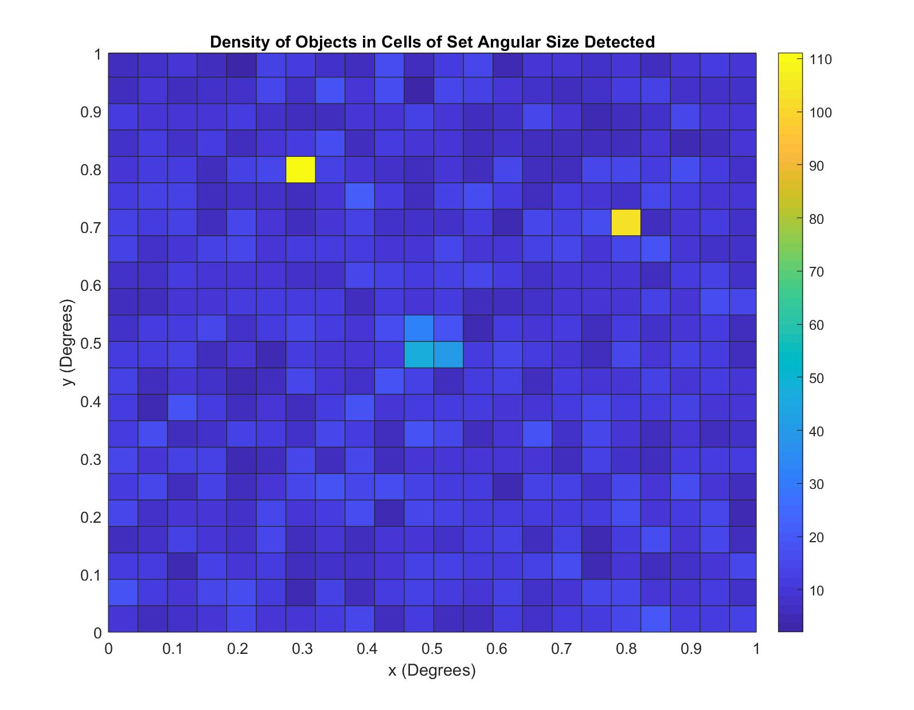
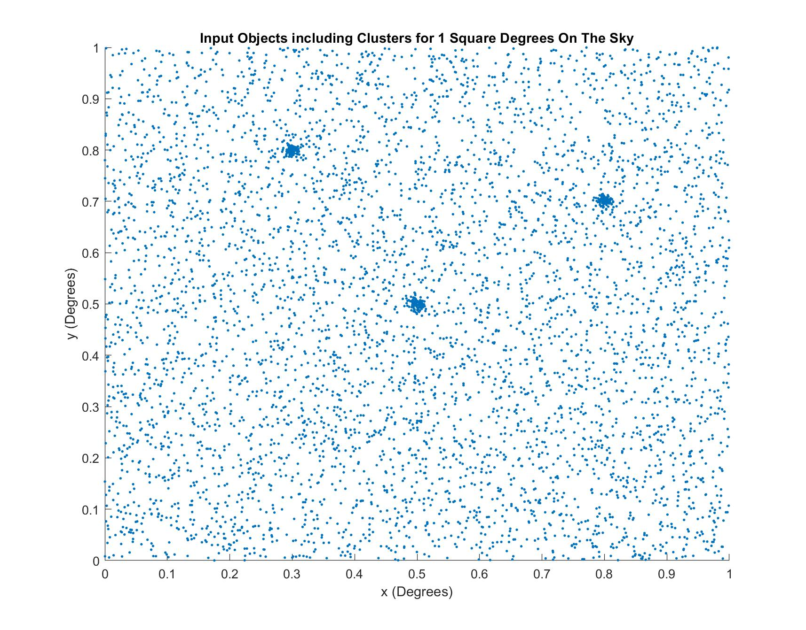

# Searching for Galaxy Clusters in the Dark Energy Survey
 
This project aimed to construct an algorithm capable of detecting galaxy clusters within data from the [Dark Energy Survey](https://www.darkenergysurvey.org/). The algorithm is coded in MATLAB and tested with simulated data constructed for this project. After simulated data tests, real data is analysed. The method of detection is relatively simple, only looking at galactic density. No obvious galaxy clusters were detected in the survey data due to limits with the detection method. The project overall is still a success despite the lack of confirmed detection, since the algorithm performed exactly as intended and all other goals were met.

## Acknowledgments

* University of Nottingham - Department of Physics and Astronomy
* Associate Professor Dr Meghan Gray (Project Supervisor)

## Sample Figures

A density map designed to show the relative density of three simulated galaxy clusters. This density comparison underpins the detection method utlised by this project. 

A scatter plot showing the grouping and relative positions of three simulated clusters in a sea of galaxy-like objects.
